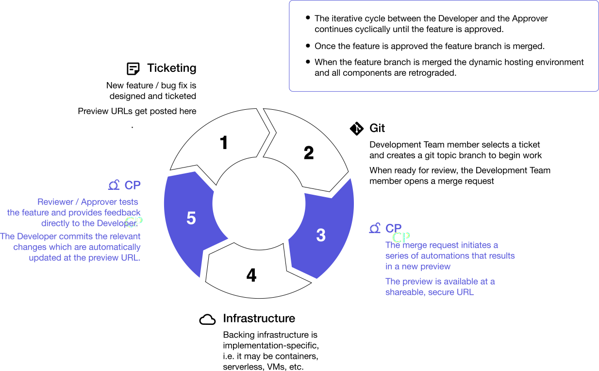

Over the past two decades since the Agile Manifesto was published, the concepts and technologies that support Continuous Integration, Continuous Delivery, Cloud Native development, Containerization, Microservices, and Container Orchestration have greatly improved the Agility with which software can be built, tested, and delivered. These concepts and technologies have ushered in the now ubiquitous concept of DevOps and have helped break down the silos within the multi-disciplinary teams that must continuously collaborate to build great software.

Despite these advances, twenty years after the advent of Agile our community still lacks a common lexicon, understanding, and capability for efficiently previewing in-progress development for full-stack applications.

Over the past 2+ years we have listened to the challenges of team software development through interviews with over 150 Developers, DevOps, and Cross-functional team members across a variety of industries and at various levels of business maturity.

These are our observations:

* The benefits of Previewing are primarily confined to software teams that have the time, resources, and expertise to build and maintain their own internal preview capability - often referred to as an internal Platform as a Service.  

* It's universally beneficial to bring QA/testing into the Development process, to catch issues early, iterate quickly, and to merge clean code into Develop or Main.  

* Virtually all teams from can benefit from a Full-Stack Preview capability and industry defined best practices for Previewing i.e. Continuous Previews.  

* For most teams a Preview Tool is on their wish list but there's no clear choices or guidelines provided by either the Open Source Community, the CNCF, or the industry as a whole.  

* As a community we are not actively collaborating or innovating towards a well-defined Preview process and technical capability.  

* The market is awash in open source and commercially available Continuous Integration, Continuous Delivery, and Deployment tools, but these tools, while integral to the overall development process, are fundamentally lacking for the task of Previewing and facilitating the requisite collaborative teamwork across cross-functional teams to produce quality working software. 

&nbsp; 
## 11 Principles of CP  

1. Significantly Easier to Fix issues Pre-merge vice Post-merge
2. Bring QA into the Development Process (CP = Continuous Collaboration between Devolopment and Product)
3. Confirm Functionality Prior to Integration
4. Isolated Feature Testing (Separation of Concerns) over batch testing
5. Tight integration between Ticketing, Repositories, Infrastructure
6. No additional burdens on the Development Team
7. Limit Context Switching
8. Reliance on Automation
9. Reduce reliance on Critical Single Points of Failure (i.e. persistent QA environment)
10. Empower Developers with Feature-level Test Environments
11. Parallelize your feature efforts - when you can test in parallel you can iterate in parallel.
12. Support for Full-stack (Front ends, Back Ends, Microservices, APls, backing services . . .)

&nbsp; 
## Traditional QA vs. Continuous Previews  
|                       Traditional QA                     | Continuous Previews                                    |
| -------------------------------------------------------- | ------------------------------------------------------ |
| Delayed feedback loop                                    | Continuous feedback loop                               |
| Feature and integration testing are batched/coupled      | Feature and integration testing are isolated/decoupled |
| Persistent QA/Test environment = single point of failure | On-demand test environments (as many as needed)        |
| Higher risk of “bricking QA”                             | Lower risk of “bricking QA”                            |
| More context switching                                   | Limited context switching                              |  

&nbsp; 
## Definition  
Continuous Preview(s) are an automation-enabled method by which in-progress development branches—known as topic branches—are continuously deployed in a dynamic production-like environment and are available for collaborative review and testing at a secure URL. By this method iterative feedback is accelerated and testing is conducted in a logical sequence where topic branch functionality testing is completed prior to integration testing and delivery.  

&nbsp; 
## CP in Practice   
&nbsp;
  

&nbsp; 
## Software Delivery KPIs Improved by CP  
* **Lead Time** - the time between when a task is created and the solution is delvered  

* **Cycle Time** - how quickly an issue can be reviewed, feedback provided, and adjustments made  

* **Team Velocity** - the number of tasks completed over a given period of time  

* **Code Stability** - how often topic branch integrations create unintended breakage    

&nbsp; 
## Background  
The initial contributors to the CP Manifesto come from diverse backgrounds including being directly or indirectly involved in the design, development, deployment, and scaling of applications from Startups to the Fortune 500; leading Machine Learning Research Teams; and leading high performance Navy SEAL teams into combat.

We seek to pioneer and promote better ways of developing software by leveraging technology and automation to push the bounds of Agile Software Development.

We are advocating for organizations to adopt Continuous Previews as an Agile-supporting method to improve and expedite how they build and test software.  

&nbsp; 
## Who should read this?    
* Any Software Developer building applications within the context of a team.
* Ops and DevOps engineers who deploy and manage such applications.
* Product leaders, designers, and team members who contribute to a software product.
* Key leaders and decision makers within your organization.
